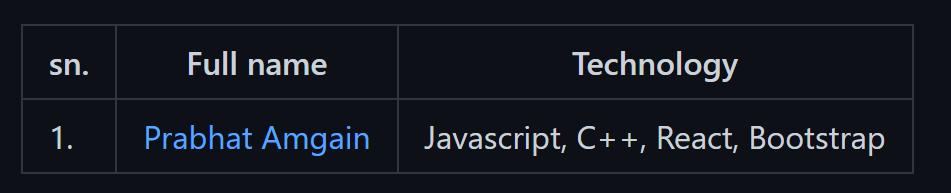

  

# First-contribution

Beginner friendly repository for individuals to participate in the Hacktoberfest 2022 event.

  

## Introduction

  

  

  

This is an event organized by BOSC (Birendra Open Source Club) and Birendra IT club aiming to make students aware about the open source and help them to celebrate the [Hacktoberfest 2022](https://hacktoberfest.com) as a festival.

  

The intent of this project is to get started with Open Source and make your first [Pull Request](https://docs.github.com/en/free-pro-team@latest/github/collaborating-with-issues-and-pull-requests/about-pull-requests)

  

## Getting started

  

- Register to our event at [register](https://forms.gle/5fc2MvoMdf2rH8K87).

  

- Visit [Hacktoberfest 2022](https://hacktoberfest.com) website

  

- Register using GitHub :octocat: or GitLab

  

- Now, you are ready to create a pull request

  

## Creating a Pull Request

  
  

-  `Fork` this repo :fork_and_knife:
  
- Now,`Clone` your forked your repo

- Add your name, GitHub profile link and technology you work on, on [CONTRIBUTORS.md](./CONTRIBUTORS.md) :raising_hand_woman: :raising_hand_man:

- `Commit your changes.

- Navigate to menu item [`Pull requests`](https://github.com/Hacktoberfest-Nepal/Your-First-PR/pulls), click on [`New Pull Request`](https://github.com/BMC-BOSC/First-contribution/compare)

  

- Provide a title and description

  

- Click `Create Pull Request`

### WOW, Congratulations!!! You just got a step closer to completing your pull requests.:smiley:

  

## To remember:

  

- Contributors are encouraged to edit on same format while doing pull request at [`CONTRIBUTORS.md`](./CONTRIBUTORS.md) else your PR may lead to spam.
Example:

  

- Check your [eligibility](https://hacktoberfest.com/participation/#contributors) for swags

- For further details [Official site](https://hacktoberfest.com/participation/)

# Don't forget to star :star: the repository.
